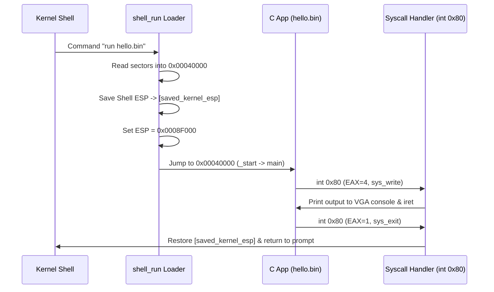

# MINI-OS C90 Application Development & Execution Guide

This guide explains how to write, compile, and execute C90 applications for **MINI-OS**.

## 1. Overview

MINI-OS supports executing user-space C applications written in **ANSI C (C90 standard)**. User binaries are loaded by the kernel Shell into physical memory address `0x00040000` with stack space allocated at `0x0008F000`. System calls are routed to the kernel through the `int 0x80` interrupt gate.

## 2. C90 Programming Guidelines for MINI-OS

### 2.1 C90 Language Constraints

When writing C code for MINI-OS, adhere strictly to C90 syntax:

1. **Variable Declarations at Block Top**: All local variables must be declared at the beginning of a block before any executable statements.

   ```c
   /* Correct C90 */
   int main(void) {
       int i;
       int sum = 0;
       for (i = 0; i < 10; i++) {
           sum += i;
       }
       return 0;
   }
   ```

   *(Do not declare `for (int i = 0; ...)` inside the loop header).*

2. **Block Comments**: Use standard C comments (`/* comment */`).
3. **No Dynamic Memory Allocation (`malloc`)**: Dynamically allocated heap memory (`malloc`/`free`) is not yet supported. Use static arrays or local stack variables.
4. **No Floating-Point Operations**: The x87 FPU is not initialized in protected mode. Avoid `float` and `double` arithmetic.

### 2.2 Standard Library Support (`minilibc`)

Applications interact with the operating system through `minilibc.h`. The current runtime provides the following API functions:

| Function Signature | Description |
| :--- | :--- |
| `int printf(const char *fmt, ...);` | Formatted output supporting `%s`, `%d`, `%x`, `%c`, `%%` |
| `int puts(const char *str);` | Outputs a string followed by a newline |
| `int write(int fd, const char *buf, unsigned int count);` | Invokes `sys_write` (FD 1 = stdout) |
| `int read(int fd, char *buf, unsigned int count);` | Invokes `sys_read` (FD 0 = stdin) with keyboard echo and backspace |
| `int getchar(void);` | Reads a single character from keyboard |
| `char *gets(char *buf);` | Reads a line of user input from keyboard into buffer |
| `void exit(int status);` | Invokes `sys_exit` to terminate the application and return to Shell |

## 3. Directory Layout for User Applications

User applications are decoupled from the MINI-OS C standard library runtime:

```plaintext
transport/
├── lib/                     <-- MINI-OS C Runtime Library
│   ├── crt0.asm             <-- Application Startup Entry (_start)
│   ├── minilibc.h           <-- Standard Library Headers
│   └── minilibc.c           <-- System Call & Utility Wrappers
├── apps/                    <-- User C Applications
│   ├── hello.c
│   └── calc.c
└── build/                   <-- Compiled Output Binaries
    ├── hello.bin
    └── calc.bin
```

### Writing a User Application (`transport/apps/hello.c`)

```c
#include "minilibc.h"

int main(void) {
    int count = 42;
    unsigned int hex_val = 0xFF;

    printf("Hello, World from C90 in MINI-OS!\n");
    printf("Test decimal: %d, Hexadecimal: 0x%x\n", count, hex_val);
    
    return 0;
}
```

## 4. Compilation and Transport Pipeline

MINI-OS uses an automated build toolchain:

```plaintext
[ transport/apps/*.c ] ──> Clang (-std=c90 -mno-sse) ──> [ build/*.o ]
                                                              │
[ crt0.o + minilibc.o ] ─────────────────────────> [ ld.lld / elf2bin ]
                                                              │
[ transport/build/*.bin ] ──> [ inject_transport ] ──> [ /external/ in mini_os.img ]
```

1. **C Runtime Startup (`crt0.asm`)**:
   - `_start` executes at entry point `0x00040000`.
   - Calls `main()`.
   - Passes `main`'s return value to `sys_exit` via `int 0x80 (EAX=1)`.

2. **Host Transport Injector (`tools/inject_transport.c`)**:
   - Built automatically during `make`.
   - Parses the MINI-OS disk image format.
   - Injects compiled binaries from `transport/build/*.bin` into the `/external/` directory on `mini_os.img`.

## 5. Building and Running User Applications

### Option A: Build All Applications

To compile all C applications in `transport/apps/` and build the OS image:

```bash
make clean
make
```

### Option B: Build a Specific Application

To compile a specific application (e.g. `calc.c`):

```bash
make app APP=calc.c
```

### Step 2: Launch QEMU Emulator

```bash
make run
```

### Step 3: Execute User Binaries in MINI-OS Shell

1. Navigate to the compiled binaries directory `/transport/build`:

   ```text
   / > cd /transport/build
   ```

2. List compiled binaries:

   ```text
   /transport/build > ls
   entries:
    - calc.bin (f)
    - hello.bin (f)
   ```

3. Run an application:

   ```text
   /transport/build > run calc.bin
   ```

### Expected Output in MINI-OS Console

```text
MINI_OS: launching app...
--- MINI-OS Calculator App ---
a = 15, b = 27
a + b = 42
a * b = 405
MINI_OS: app exited cleanly.
/transport/build >
```

## 6. Execution Flow & Architecture Breakdown



## 7. Memory Boundaries & Limitations

- **Executable Base**: `0x00040000`
- **Application Stack**: `0x0008F000` (grows downwards)
- **Maximum Application Size**: ~320 KB (code + static data + stack)
- **System Call Integers**: `sys_exit` = 1, `sys_write` = 4
