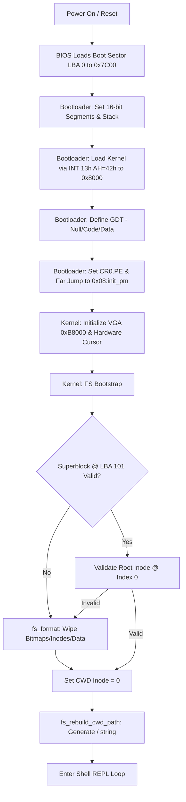
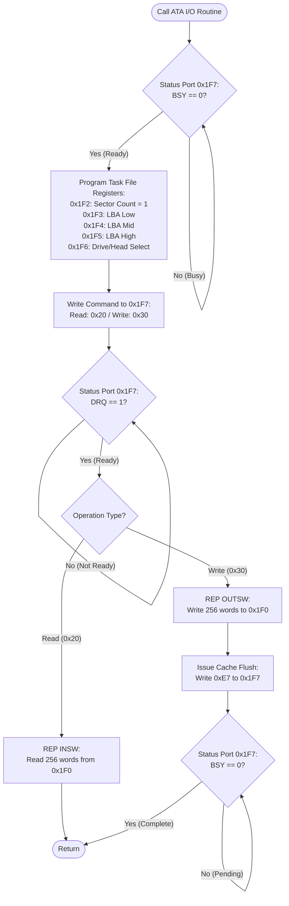
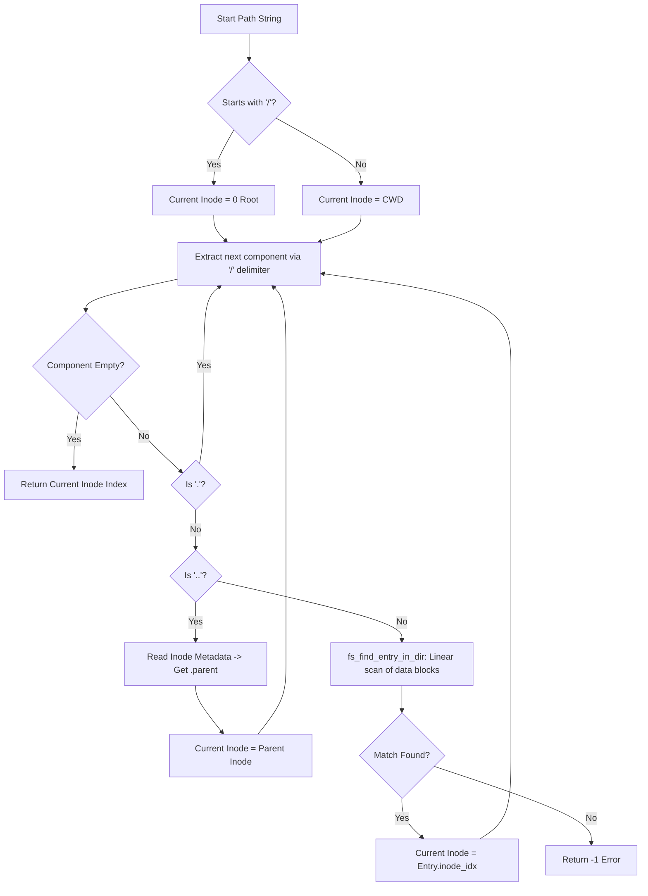
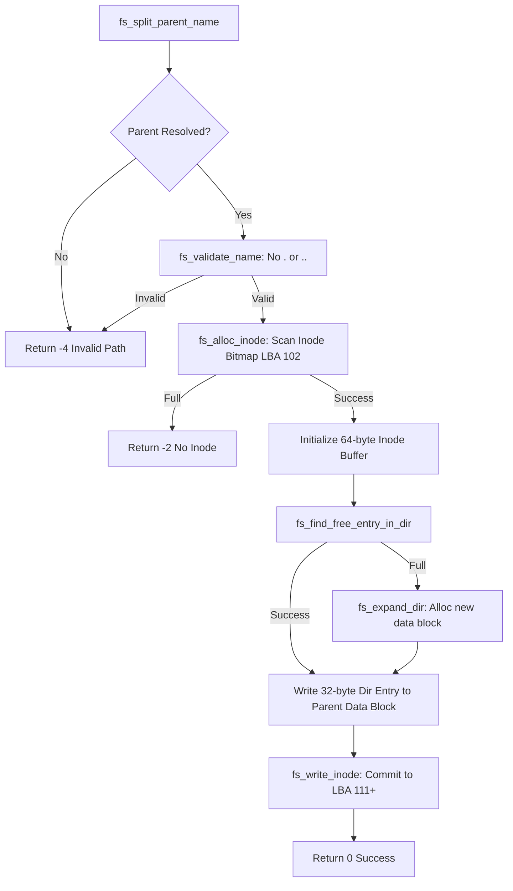
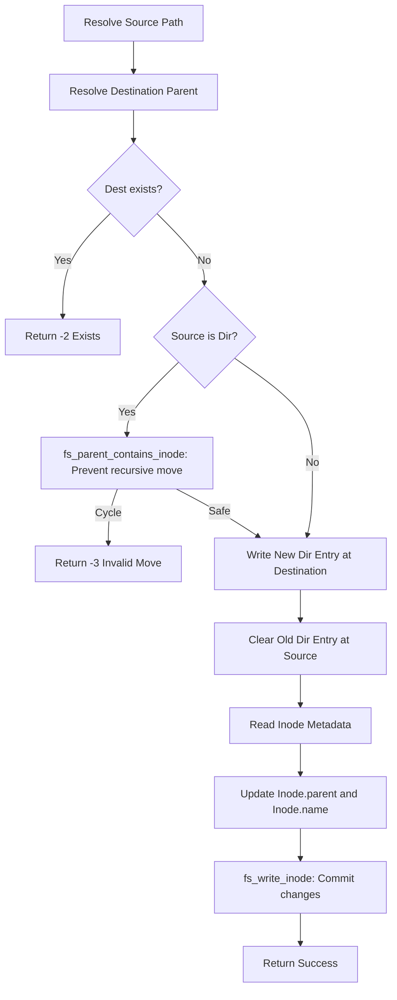
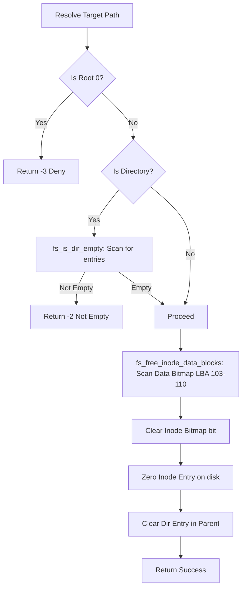
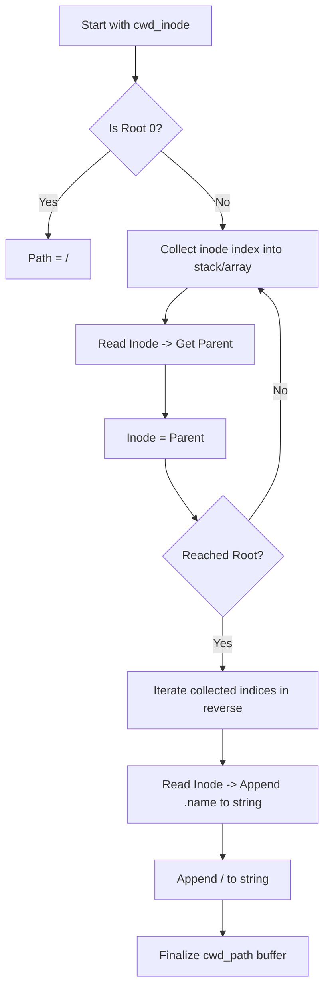
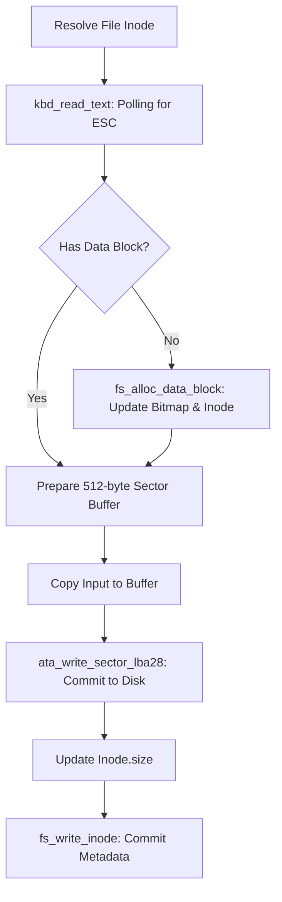

# MINI-OS Workflows

This document visualizes the core execution paths of MINI-OS using Mermaid diagrams, covering hardware drivers, filesystem internals, and kernel logic.

## 1. Boot and Kernel Initialization

This flow describes the transition from BIOS to the functional Shell.

## 2. Low-Level Disk I/O (ATA PIO LBA28)

This section details the synchronous hardware handshake in `drivers.asm`. Note the distinct polling loops for BSY and DRQ status bits.

## 3. Path Resolution (`fs_resolve_path`)

The mechanism used by `cd`, `ls`, `cat`, etc., to locate an object.

## 4. File Creation (`touch`)

Metadata allocation and directory entry synchronization.

## 5. Rename and Move Logic (`mv`)

The most complex operation in the filesystem (`fs_rename_path`).

## 6. Removal Logic (`rm`)

Cleanup of data blocks and metadata.

## 7. CWD Path Rebuilding

How the shell prompt (e.g., `/docs/work/`) is generated.

## 8. File Editing (`edit`)

Single-sector text I/O flow.

